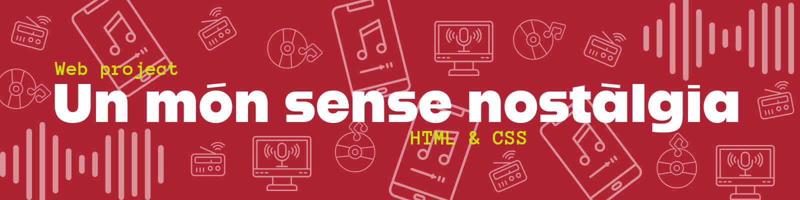

**Author:** Clàudia Trigo Joaquin  
**University:** Open University of Catalonia (UOC)  
**Year:** 2025  
**Course:** HTML and CSS

---

## 🌐 Project Overview
This project presents a three-page website developed as part of the **HTML and CSS** course at UOC.  
It explores the relationship between **nostalgia, digital culture, and Artificial Intelligence in music** through a structured and responsive design.

---

## 🧠 Structure
The website is divided into three main sections:

### 📰 `index.html` — *Article*
An adaptation of *“Un món sense nostàlgia”* by **José Heinz**, reflecting on nostalgia, algorithmic culture, and the idea of a perpetual present.

### 🎵 `recursos.html` — *Resources*
A curated list of **music-related AI tools** for composition, singing, production, and audio manipulation, including examples and links.

### 📚 `glossari.html` — *Glossary*
A detailed glossary defining all the Artificial Intelligence tools mentioned in the resources section, organized by category.

### 🎨 `style.css` — *Design*
Custom stylesheet applying responsive layouts, semantic structure, and a clean, minimalist visual identity.

---

## ⚙️ Features
- Semantic **HTML** structure  
- Responsive **CSS** design  
- Internal and external linking  
- Embedded **audio** and **video** elements  
- Accessible layout and clear navigation menu  

---

## 🧩 Technologies Used
- 
-  
- Basic media embedding (audio/video)  
- No frameworks or external libraries  

---

## 🔧 Key Skills Demonstrated
- **Responsive Design:** Mobile-first layout built with CSS Flexbox and media queries.  
- **Accessibility:** Semantic HTML5 structure and ARIA-friendly navigation.  
- **Version Control:** Project managed using Git and GitHub (branching, commits, README documentation).  
- **Design Consistency:** Use of a coherent color palette and typography aligned with UX principles.  
- **Content Structuring:** Multi-page navigation with internal and external linking.  
- **Code Clarity:** Clean and organized file structure for scalability. 

---

## 💡 Learning Objectives
This project allowed me to:
- Apply semantic structure to improve accessibility and SEO.
- Understand how content hierarchy impacts user reading flow.
- Practice consistency in design through color, spacing, and rhythm.
- Reinforce version control workflows with Git.